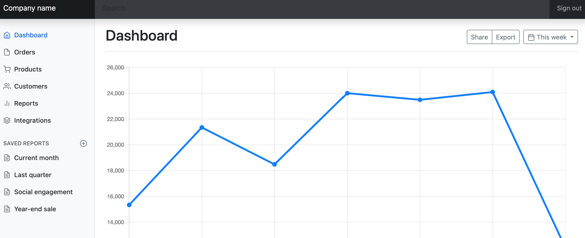

# Apache Web Sunucusu Docker Bootstrap Dashboard Demo

Bootstrap tabanlı statik web sayfalarınızı Apache web sunucusu ile nasıl yayınlanacağını gösteren bir örnek. 
* Bootstrap içeren statik web sitesi src klasöründedir.
* Dockerfile dosyasında src klasörünü apache sunucusuna kopyalayan kod parçaları yer almaktadır.

## Çalıştırma

* docker build -t apache . 
* docker run -d --name apache-sunucu -p 8080:80 apache

